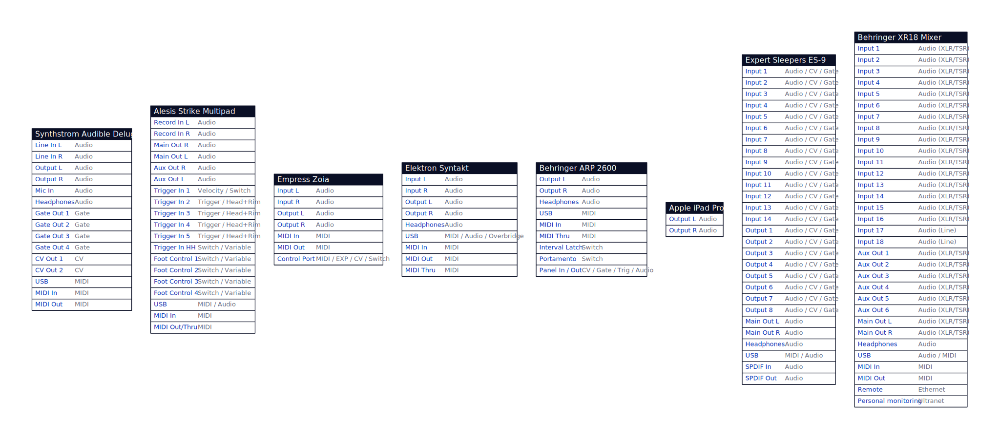

# Gear

## Synthstrom Audible Deluge
- [Deluge Product Page](https://synthstrom.com/product/deluge/#downloads) (Downloads)
- [Deluge Community Firmware](https://github.com/SynthstromAudible/DelugeFirmware)

## Empress Zoia
- [Zoia Product Page](https://empresseffects.com/products/zoia)
- [Zoia User Manual](https://support.empresseffects.com/support/solutions/articles/1000282818)

## Expert Sleepers ES-9
- [ES-9 Product Page](https://www.expert-sleepers.co.uk/es9.html)
- [ES-9 Resources](https://www.expert-sleepers.co.uk/es9firmware.html)

## Behringer ARP 2600
- [ARP 2600 Product Page](https://www.behringer.com/product.html?modelCode=P0DNJ)

## Behringer XR18
- [XR18 Product Page](https://www.behringer.com/product.html?modelCode=P0BI8)
- [XR18 Documentation](https://mediadl.musictribe.com/media/PLM/data/docs/X-AIR/M_BE_0605-AAA_X-AIR_EN.pdf)

# Diagram

[Diagram source code](studio.d2)  
## Diagram Tool
D2 Declarative Diagramming: https://github.com/terrastruct/d2
